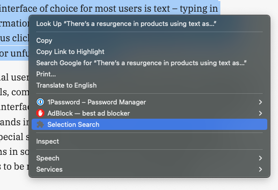
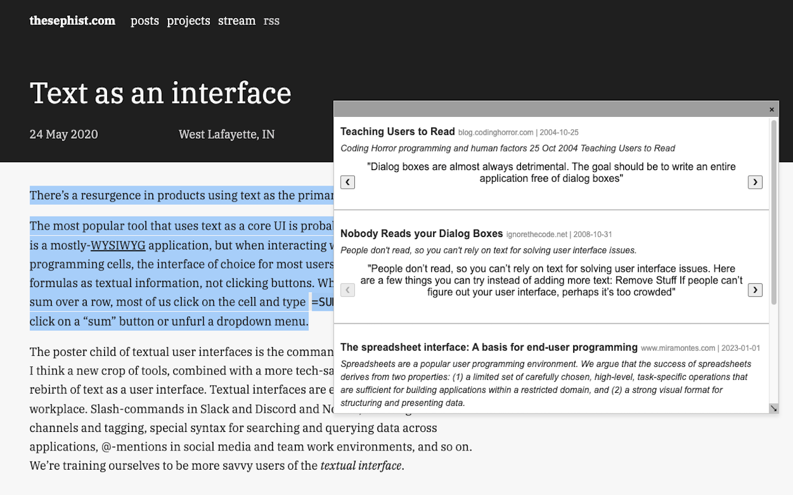

## Selection Search

A Chrome extension that finds semantically related web content to any selected text. It uses the [Exa Search API](https://exa.ai).

## Usage

- Download the [Chrome extension](link)
- Get an [Exa API key](https://dashboard.exa.ai/api-keys) and enter it into the extension's popup.
- Select any text on a website (on a blog, a pdf, a tweet, etc), right click and click `Selection Search`.

A new modal will appear in the website with semantically relevant search results as shown below.

## Examples

