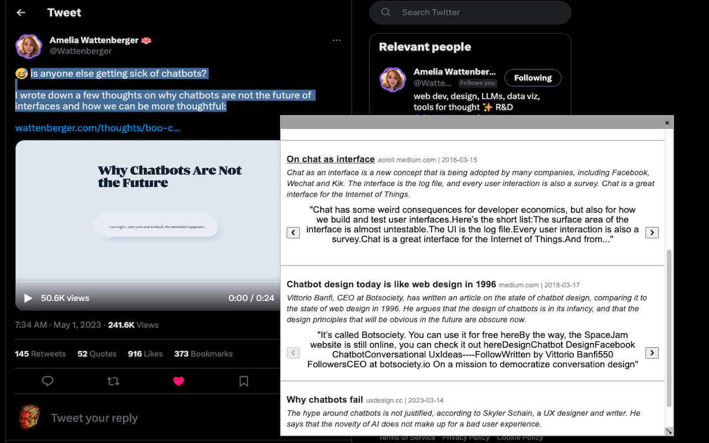

## Selection Search

This is a Google Chrome Extension that allows you to highlight text on a webpage and find semantically related content. It uses the
- [Metaphor API](https://dashboard.metaphor.systems/) (closed Beta currently) to search for semantically related content
- [Cohere API](https://dashboard.cohere.ai/) to summarize those links for easier browsing.

## Usage

This extension adds a new option called "Selection Search" to the context menu (the menu that appears when you right click on a website). Select, right click, choose "Selection Search" and a new modal will appear in the website with semantically relevant search results. See below.

## Examples

## Install

Steps:
- Clone repo
- Get an API key from both Metaphor and Cohere.
- Add the API keys to the top of `background.js`.
- Follow the [Chrome Extension installation instructions](https://developer.chrome.com/docs/extensions/mv3/getstarted/development-basics/#load-unpacked)

